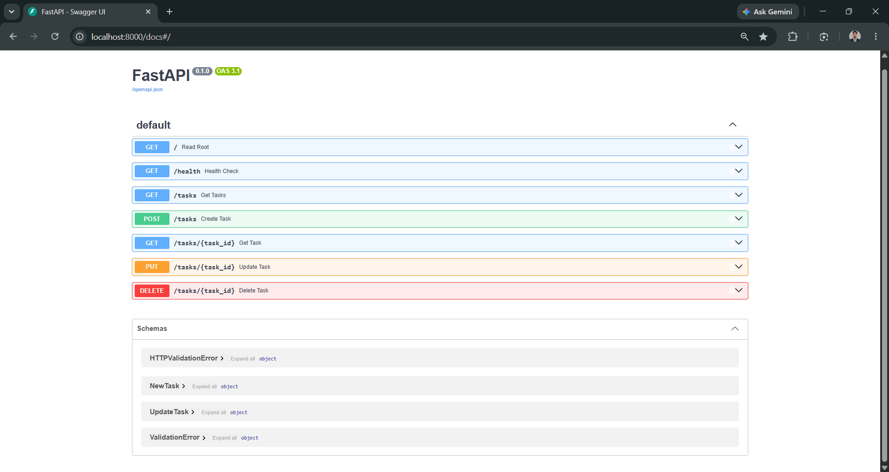
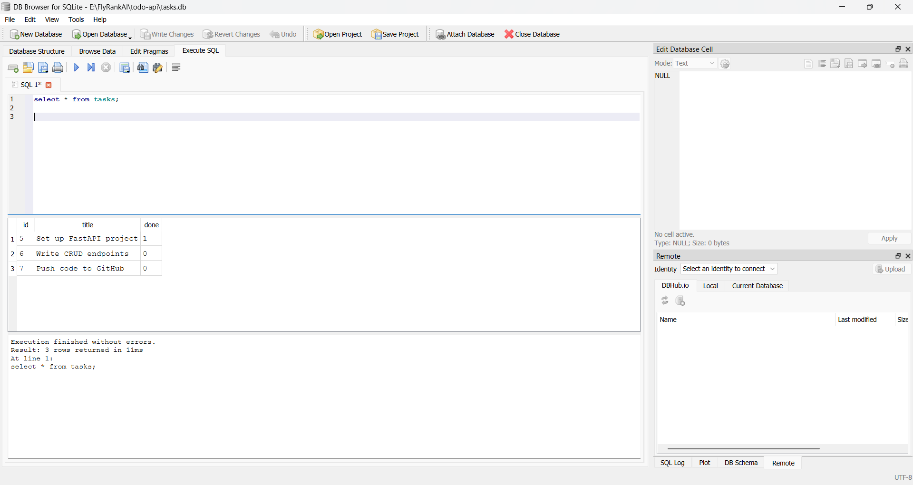

# Task API

A simple in-memory CRUD API for managing a to-do list, built with FastAPI.

## How to run

\`\`\`bash
python3 -m venv venv
source venv/bin/activate      # Windows: venv\Scripts\activate
pip install fastapi uvicorn
uvicorn main:app --reload --port 8000
\`\`\`

Then visit `http://localhost:8000` or `http://localhost:8000/docs` for interactive Swagger UI.

## Endpoints

| Method | Path            | Description                     |
|--------|-----------------|----------------------------------|
| GET    | /               | API info                         |
| GET    | /health         | Health check                     |
| GET    | /tasks          | List all tasks                   |
| GET    | /tasks/{id}     | Get one task by id               |
| POST   | /tasks          | Create a new task                |
| PUT    | /tasks/{id}     | Update a task's title/done status|
| DELETE | /tasks/{id}     | Delete a task                    |

## Example request

\`\`\`
curl.exe -i http://localhost:8000/tasks

HTTP/1.1 200 OK
date: Thu, 10 Sep 2026 05:52:32 GMT
server: uvicorn
content-length: 40
content-type: application/json

{"id":1,"title":"Buy milk","done":false}
\`\`\`

## Swagger UI

## Assignment - 2
## Database

This project now uses SQLite instead of an in-memory list, so data survives a server restart.

**Why SQLite:** it's a single file (`tasks.db`), needs no separate server or install, and is perfect for a small project like this. For a larger production app with many concurrent users, you'd reach for something like PostgreSQL instead.

`tasks.db` is created automatically the first time the app runs, and is git-ignored — every fresh clone starts with its own database, seeded with the same 3 example tasks.

### Run it

\`\`\`bash
python3 -m venv venv
source venv/bin/activate      # Windows: venv\Scripts\activate
pip install fastapi uvicorn
uvicorn main:app --reload --port 8000
\`\`\`

`tasks.db` will be created automatically on first run.

### Example SQL query

\`\`\`sql
SELECT COUNT(*) FROM tasks;
\`\`\`
Returned `3` after the initial seed, confirming the seed-once logic worked correctly and didn't duplicate on restart.

### DB Browser screenshot

